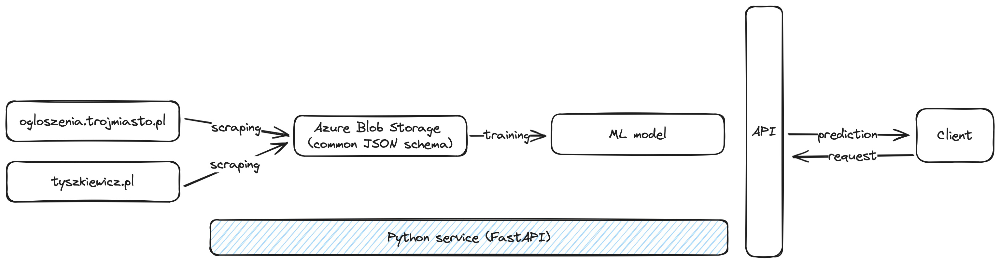

[![CC BY-SA 4.0][cc-by-sa-shield]][cc-by-sa]

# House pricing prediction ML pipeline

This project was made as a final exercise for a data-oriented programming course at the University of Gdańsk.

It scrapes data from 2 big real-state listing portals, saves it into Azure Blob Storage in a JSON format, and lets you train and use different ML models based on fetched data. We also provided an API layer to let end-users easily interact with a system. Below you can see a diagram representing the system design.

## System design

The architecture of the system is depicted in the diagram below:

### Note

This project is designed to showcase our Python skills. We prioritize model clarity over complexity, and while the unit test coverage is minimal, the provided examples demonstrate our understanding of effective testing. The API design is intentionally streamlined for clarity and ease of understanding. Similarly, the data scraping component is kept straightforward to highlight its potential capabilities.

## Tech stack / Skills

### Programming Paradigms and Techniques

- Object-oriented programming (OOP)
- Type hints
- Generators
- Regular expressions

### Data Version Control and Storage

- dvc (with Azure Blob Storage)
- Git
- Azure Blob Storage

### Frameworks and Libraries

- FastAPI
- BeautifulSoup4
- Pydantic

### Development Tools

- Docker
- GitHub Actions
- .pre-commit hooks
- Static analysis tools

### Other

- Unit tests
- Logging
- Environment variables

## Deploy

### Deploy with Docker (recommended)

1. Run `docker pull gdahuks/housing_price_prediction` to pull the Docker image from [Docker Hub](https://hub.docker.com/r/gdahuks/housing_price_prediction). Alternatively, you can build the image yourself (needed if target platform is not linux/amd64 or linux/arm64) by running `docker build -t housing_price_prediction  .` in the project's root directory.
2. Create a `.env` file and update it with credentials for the container storing scraping results following the `.env.template` file. Alternatively, you can pass the environment variables directly to the `docker run` command (see step 3).
3. Run `docker run -d --publish 8000:8000 --env-file .env housing_price_prediction` to run Docker container on port 8000.
4. Visit [http://0.0.0.0:8000/docs](http://0.0.0.0:8000/docs) to explore the API documentation. (Since Swagger does not support Body in GET, for predictions you should use another tool such as Postman).

### Deploy locally

1. Install requirements from the `requirements.txt` file.
2. Create a `.env` file and update it with credentials for the container storing scraping results following the `.env.template` file. Alternatively, you can pass the environment variables directly to the `docker run` command (see step 3).
3. Run `docker run -d --publish 8000:8000 --env-file .env housing_price_prediction` to run Docker container on port 8000.
4. Visit [http://0.0.0.0:8000/docs](http://0.0.0.0:8000/docs) to explore the API documentation. (Since Swagger does not support Body in GET, for predictions you should use another tool such as Postman).

### Download already trained model

1. Create a `config.local` file in the `.dvc/` directory and update it with your credentials to trained model in Azure Blob Storage (url with SAS token) the `.dvc/config.local.template` file.
2. Run `dvc pull` to download data from Azure Blob Storage.

## License

This work is licensed under a
[Creative Commons Attribution-ShareAlike 4.0 International License][cc-by-sa].

[![CC BY-SA 4.0][cc-by-sa-image]][cc-by-sa]

[cc-by-sa]: http://creativecommons.org/licenses/by-sa/4.0/
[cc-by-sa-image]: https://licensebuttons.net/l/by-sa/4.0/88x31.png
[cc-by-sa-shield]: https://img.shields.io/badge/License-CC%20BY--SA%204.0-lightgrey.svg
